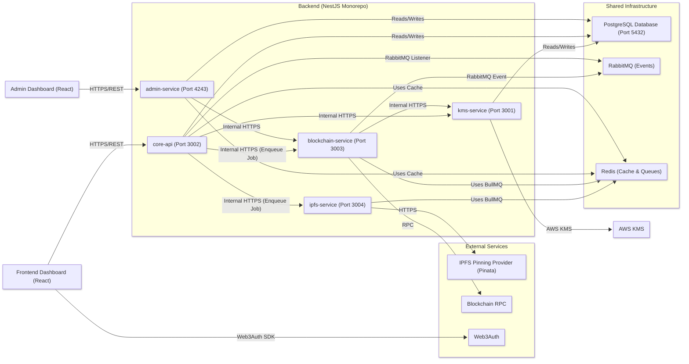

# System Architecture Overview

The Empressa platform is a distributed system composed of backend microservices and a frontend application that work together to provide a full-featured digital asset marketplace. This document provides a high-level visual diagram and a breakdown of each component's role.

*Last Updated: January 16, 2026*

## Architectural Diagram

This diagram illustrates the primary components of the system and their main communication paths.

## Component Responsibilities

### Frontend Applications

- **Frontend Dashboard**: The main React application for users. It handles asset browsing, publishing, purchasing, management, and data room access. It communicates with the `core-api` for all backend operations.
- **Admin Dashboard**: An internal React application for platform administrators. It is used for moderating content, approving organization requests, managing users, and viewing analytics. It communicates exclusively with the `admin-service`.

### Backend Services

This monorepo orchestrates the primary business logic of the platform.

- **`core-api` (Port 3002)**: The main API gateway for the Frontend Dashboard. It handles user authentication (exchanging Web3Auth tokens for internal JWTs), provides REST endpoints for all user-facing actions, proxies requests to other services, and kicks off complex asynchronous workflows (like asset publishing). It also includes data room management functionality.
- **`admin-service` (Port 4243)**: A dedicated API for the Admin Dashboard. It handles administrator authentication (email/password with JWT) and exposes endpoints for moderation and management tasks.
- **`kms-service` (Port 3001)**: A secure, internal service responsible for creating, storing, and retrieving user cryptographic keys (blockchain wallets) using envelope encryption with AWS KMS.
- **`ipfs-service` (Port 3004)**: A background worker that processes file uploads. It receives jobs via a BullMQ queue, retrieves files from temporary storage, and pins them to Pinata (IPFS provider).
- **`blockchain-service` (Port 3003)**: A background worker that handles all on-chain interactions. It receives jobs via a BullMQ queue (e.g., "create asset"), executes transactions against the smart contracts using Ethers.js, and publishes the final result (success or failure) as an event to RabbitMQ.

### Shared Infrastructure

- **PostgreSQL Database (Port 5432)**: The primary persistent storage for all off-chain data, including user profiles, organization details, asset metadata, transaction records, and data room information. Managed by Prisma.
- **Redis (Port 6379)**: Serves two purposes: as a message broker for the **BullMQ** job queues used by `ipfs-service` and `blockchain-service`, and as a caching layer for services like `core-api` and `admin-service`.
- **RabbitMQ (Ports 5672/15672)**: An event broker used for inter-service communication *after* a job is complete. For example, `blockchain-service` publishes a `transaction.finalized` event here, which `core-api` listens to in order to perform final data reconciliation.

### External Services

- **AWS KMS**: Key Management Service used by `kms-service` for envelope encryption of user wallet private keys.
- **IPFS (Pinata)**: IPFS pinning service used by `ipfs-service` for decentralized file storage.
- **Ethereum RPC**: Blockchain RPC endpoint used by `blockchain-service` for on-chain transactions.
- **Web3Auth**: Authentication provider used by the frontend for user authentication.
