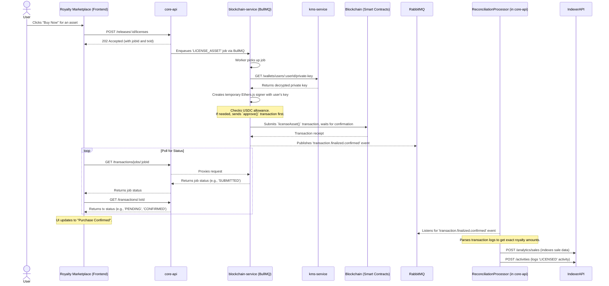

# Core Workflow: Asset Licensing (Purchase)

This document describes the end-to-end process for a user purchasing a license for a digital asset. This is a critical on-chain workflow that must be secure, reliable, and provide clear feedback to the user throughout the process.

The flow is initiated by the user in the `royalty-marketplace` and orchestrated by the `core-backend` services to execute a smart contract interaction.

## High-Level Strategy

1. **Initiation:** The user clicks "Buy Now" on the frontend, which sends a request with the asset ID to the `core-api`.
2. **Job Enqueueing:** The `core-api` validates the request and enqueues a `LICENSE_ASSET` job in the `blockchain-service` via a BullMQ queue.
3. **Transaction Execution:** The `blockchain-service` worker fetches the user's private key from the `kms-service`, approves the USDC transfer, and executes the `licenseAsset` function on the appropriate smart contract.
4. **Event-Driven Reconciliation:** Upon transaction confirmation, the `blockchain-service` publishes a `transaction.finalized` event. The `ReconciliationProcessor` in `core-api` listens for this event to index the sale for analytics and log the activity.
5. **Frontend Polling:** The frontend uses the `useTransactionWorkflow` composable to poll for the job and transaction status, providing the user with real-time feedback (e.g., "Submitted", "Confirmed").

## Sequence Diagram

## Step-by-Step Explanation

1. **User Initiates Purchase (`royalty-marketplace`):**
    * A user on an asset's detail page clicks the "Buy Now" button.
    * The `useTransactionWorkflow` composable in the frontend calls the `useLicenseAsset` mutation, which sends a `POST /releases/:releaseId/licenses` request to the `core-api`.

2. **Job Creation (`core-api`):**
    * The `core-api` receives the request. It performs initial validations (e.g., ensuring the asset is verified and has a price).
    * It creates a `PENDING` transaction record in the centralized `indexer-api` database. This allows the frontend to start polling for status immediately.
    * It enqueues a `LICENSE_ASSET` job in the `blockchain-jobs` **BullMQ** queue, passing a detailed payload including the asset's on-chain ID, price, and the buyer's user ID.
    * The `core-api` immediately responds to the frontend with a `202 Accepted` status, along with the `jobId` and `txId` for polling.

3. **Transaction Execution (`blockchain-service`):**
    * A worker in the `blockchain-service` picks up the `LICENSE_ASSET` job.
    * It makes a secure, internal HTTP request to the `kms-service` to retrieve the **decrypted private key** for the buyer's wallet.
    * It creates a temporary in-memory Ethers.js `Wallet` instance (a "signer") using this private key.
    * **USDC Approval:** Using the buyer's signer, it checks the user's USDC allowance for the `LicenseManager` smart contract. If the allowance is insufficient, it first signs and sends an `approve()` transaction, waiting for it to be confirmed before proceeding.
    * **License Execution:** It then signs and sends the actual `licenseAsset()` transaction to the organization's smart contract, again using the buyer's signer. The worker waits for this transaction to be mined and confirmed.

4. **Frontend Feedback (`royalty-marketplace`):**
    * While the backend is processing, the `useTransactionWorkflow` composable on the frontend is polling two endpoints on the `core-api`:
        * `GET /transactions/jobs/:jobId`: Checks the status of the BullMQ job (`QUEUED`, `SUBMITTED`, `SUCCESS`, `ERROR`).
        * `GET /transactions/:txId`: Checks the status of the on-chain transaction (`PENDING`, `CONFIRMED`, `FAILED`).
    * The UI is updated with snackbars and loading states based on these responses (e.g., "Purchase Submitted...", "Confirming on-chain...").

5. **Event Publishing (`blockchain-service`):**
    * Once the `licenseAsset` transaction is confirmed, the `blockchain-service` publishes a `transaction.finalized.confirmed` event to **RabbitMQ**. This event includes the transaction hash, block number, and the original job payload.

6. **Final Reconciliation (`core-api`):**
    * The `ReconciliationProcessor` in `core-api` listens for this event.
    * It parses the transaction logs from the event to extract the exact amounts distributed (creator royalty, platform fee, etc.).
    * It makes two final API calls to the `indexer-api`:
        1. `POST /analytics/sales`: It saves a detailed record of the sale for financial analytics.
        2. `POST /activities`: It creates a `LICENSED` activity record, which will appear in the asset's history.

7. **Flow Completion:**
    * The frontend polling receives the `CONFIRMED` status and displays a final success message. The user's queries for "My Library" or "My Purchases" are invalidated and refetched, now including the newly licensed asset.
