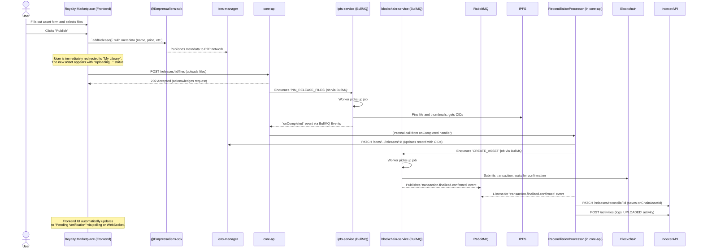

# Core Workflow: Asset Publishing

Publishing an asset is the most complex workflow in the Empressa platform. It is a multi-stage, asynchronous process that involves the frontend, the P2P network, and nearly every microservice in the backend.

The flow is designed to provide a fast and responsive user experience. The user submits their asset and can immediately move on, while the heavy lifting of file processing and blockchain interaction happens reliably in the background.

## High-Level Strategy

1. **Metadata First (P2P):** The asset's metadata (name, description, price, etc.) is immediately published to the P2P network. This makes it instantly visible in the user's "My Library" view.
2. **Files Second (Centralized Queues):** The main asset file and thumbnails are uploaded to the `core-api`, which kicks off a series of background jobs managed by queues.
3. **Event-Driven Reconciliation:** Once the background jobs are complete (files are on IPFS, transaction is on-chain), events are published to a message broker. A final processor listens for these events to tie everything together, updating the P2P and indexed records with the final CIDs and on-chain IDs.

## Sequence Diagram

## Step-by-Step Explanation

1. **User Submits Form (`royalty-marketplace`):**
    * A creator fills out the "Publish Your Work" form, providing metadata like the asset's title, price, and description, and selects the main file and thumbnails.

2. **Instant Metadata Publish (P2P):**
    * Upon clicking "Publish", the frontend immediately calls the `useP2pPublishAsset` composable.
    * This uses the `@Empressa/lens-sdk` to create a new asset record with the metadata and a `PENDING_UPLOAD` status for the file CIDs.
    * This metadata is instantly broadcast over the P2P network. The `lens-manager` service receives this and immediately forwards it to the `indexer-api` to be stored in the database.
    * The user is redirected to their "My Library" page, where the new asset appears almost instantly (reflecting the P2P state).

3. **File Upload to `core-api`:**
    * Simultaneously, the `useUploads` composable sends the actual file blobs in a `multipart/form-data` request to the `core-api`'s `/releases/:releaseId/files` endpoint.
    * The `core-api` accepts the request and immediately returns a `202 Accepted` response, signifying that the background processing has begun.

4. **IPFS Pinning Job (`ipfs-service`):**
    * The `core-api` saves the uploaded files to a temporary local volume.
    * It then enqueues a `PIN_RELEASE_FILES` job into the **BullMQ** queue named `ipfs-pinning`.
    * A worker in the `ipfs-service` picks up this job, reads the files from temporary storage, pins them to Pinata (IPFS provider), and gets the final Content IDs (CIDs).

5. **IPFS Job Completion & First Reconciliation (`core-api`):**
    * The `IpfsEventsProcessor` within `core-api` listens for the `completed` event from the `ipfs-pinning` queue.
    * When the event is received, the processor triggers an internal flow:
        1. It calls the `lens-manager` to **update the P2P record**, replacing the `PENDING_UPLOAD` status with the real file CIDs.
        2. It proceeds to the next stage: on-chain creation.

6. **Blockchain Transaction Job (`blockchain-service`):**
    * The `ReconciliationProcessor` in `core-api` enqueues a `CREATE_ASSET` job into the `blockchain-jobs` queue. This job payload includes all necessary on-chain data (CIDs, hashes, price).
    * A worker in the `blockchain-service` picks up the job. It fetches the user's private key from the `kms-service`, signs the transaction, and submits it to the blockchain.
    * The worker then waits for the transaction to be mined and confirmed.

7. **Transaction Finalized Event (`RabbitMQ`):**
    * Once the transaction is confirmed (or fails), the `blockchain-service` publishes a `transaction.finalized.confirmed` (or `.failed`) event to the **RabbitMQ** message broker. This event contains the final transaction hash and any data extracted from transaction logs (like the new on-chain Asset ID).

8. **Final Reconciliation (`core-api`):**
    * The `ReconciliationProcessor` in `core-api` is also subscribed to this RabbitMQ topic.
    * Upon receiving the `confirmed` event, it performs the final updates:
        1. It calls the `indexer-api` to **save the on-chain Asset ID** to the corresponding release record in the database. This is the crucial link between the off-chain and on-chain worlds.
        2. It calls the `indexer-api` again to create an `UPLOADED` activity record for the asset's history.

9. **UI Update:**
    * The `royalty-marketplace` frontend, which may be polling the asset's status, will see the `verificationStatus` change from `UNVERIFIED` to `PENDING_VERIFICATION`, completing the user-visible flow.
