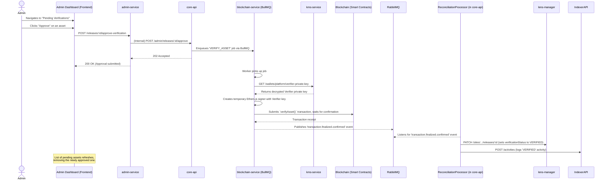

# Core Workflow: Admin Asset Verification

This document outlines the process by which a platform administrator reviews and approves an asset that has been published by a creator. This is a crucial moderation workflow that combines manual review with an automated, on-chain action.

The flow begins in the `admin-dashboard` and triggers a job in the `blockchain-service`, which uses a dedicated, platform-owned "Verifier" wallet to execute the transaction.

## High-Level Strategy

1. **Review:** An administrator views a list of assets with `UNVERIFIED` status in the `admin-dashboard`.
2. **Initiation:** The admin clicks "Approve" for an asset, sending a request to the `admin-service`.
3. **Job Enqueueing:** The `admin-service` forwards the approval request to the `core-api`, which is responsible for orchestrating on-chain jobs. The `core-api` then enqueues a `VERIFY_ASSET` job in the `blockchain-service`.
4. **Transaction Execution:** The `blockchain-service` worker fetches the platform's **Verifier Wallet private key** from the `kms-service` and executes the `verifyAsset` function on the appropriate smart contract.
5. **Event-Driven Reconciliation:** Upon transaction confirmation, a `transaction.finalized` event is published. The `ReconciliationProcessor` listens for this event and updates the asset's status on the P2P network via the `lens-manager`.

## Sequence Diagram

## Step-by-Step Explanation

1. **Admin Review (`admin-dashboard`):**
    * An administrator logs into the `admin-dashboard` and navigates to the "Pending Verifications" page.
    * This page fetches a list of all assets with the `UNVERIFIED` status from the `admin-service`.
    * The admin reviews an asset and clicks the "Approve" button.

2. **Request Initiation (`admin-service`):**
    * The `admin-dashboard` sends a request to the `admin-service`'s `/releases/:id/approve-verification` endpoint.
    * The `admin-service`, acting as a secure gateway, validates the admin's session. It then forwards the approval request via an internal, service-to-service call to a protected endpoint on the `core-api`. This ensures that the powerful job-creation logic in `core-api` is not directly exposed.

3. **Job Enqueueing (`core-api`):**
    * The `core-api` receives the request and creates a `VERIFY_ASSET` job. The job payload contains the asset's `releaseId`, its on-chain ID, and its P2P `siteAddress`.
    * This job is enqueued into the `blockchain-jobs` **BullMQ** queue.

4. **Transaction Execution (`blockchain-service`):**
    * A worker in the `blockchain-service` picks up the `VERIFY_ASSET` job.
    * It makes a secure, internal HTTP request to the `kms-service` to retrieve the **private key for the platform's dedicated Verifier Wallet**. This is a special, privileged wallet used only for this purpose.
    * It creates a temporary in-memory Ethers.js signer using the Verifier's private key.
    * Using this signer, it calls the `verifyAsset()` function on the appropriate organization's smart contract. This function is typically restricted to addresses that have been granted a `VERIFIER_ROLE`.
    * The worker waits for the transaction to be confirmed on the blockchain.

5. **Event Publishing (`blockchain-service`):**
    * Once the transaction is confirmed, the `blockchain-service` publishes a `transaction.finalized.confirmed` event to **RabbitMQ**.

6. **Final Reconciliation (`core-api`):**
    * The `ReconciliationProcessor` in `core-api` listens for this event. Upon receiving it, it performs the crucial final steps:
        1. It makes an API call to the `lens-manager` to **update the asset's P2P record**, changing its `verificationStatus` from `UNVERIFIED` to `VERIFIED`. This change is automatically propagated across the P2P network and to the `indexer-api`.
        2. It calls the `indexer-api` to create a `VERIFIED` activity record for the asset's history.

7. **Flow Completion:**
    * The `admin-dashboard` automatically refreshes its list of pending verifications, and the newly approved asset is no longer present.
    * In the `royalty-marketplace`, the asset now appears with a "Verified" status and its "Buy Now" button becomes active, making it available for purchase.
