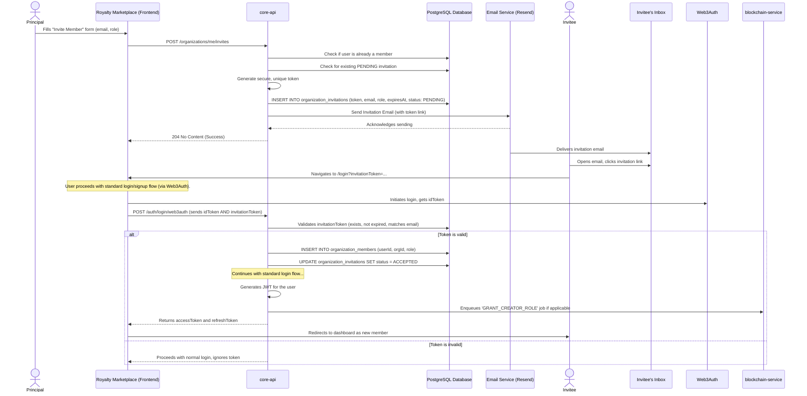

# Core Workflow: Invite Member

This document outlines the process of an organization's Principal or Admin inviting a new member to join their team. The flow is designed to be secure, using single-use tokens, and to gracefully handle invitations for both existing platform users and individuals who have not yet signed up.

## High-Level Strategy

1. **Initiation:** A Principal/Admin in the `royalty-marketplace` submits a form with the new member's email and desired role.
2. **Token Generation:** The `core-api` receives the request, validates it, and generates a unique, secure invitation token which is stored in the database with an expiration date.
3. **Email Notification:** An email containing a special invitation link (with the token) is sent to the invitee.
4. **Acceptance & Onboarding:** The invitee clicks the link.
    * If they are not logged in, they are taken to the login/signup page.
    * After authenticating, the `invitationToken` is processed by the `core-api` during the login flow.
5. **Membership Creation:** The `core-api` validates the token, adds the user to the organization by creating an `OrganizationMember` record, and marks the invitation as `ACCEPTED`.
6. **On-Chain Role Grant:** If the organization is fully provisioned with a smart contract, a background job is enqueued to grant the corresponding on-chain role (e.g., `CREATOR_ROLE`).

## Sequence Diagram

## Step-by-Step Explanation

1. **Invitation Initiated (`royalty-marketplace`):**
    * An authenticated user with the `Principal` or `Admin` role navigates to the organization settings and opens the "Invite Member" dialog.
    * They enter the prospective member's email address and select a role (e.g., `Creator`).
    * The frontend sends a `POST /organizations/me/invites` request to the `core-api`.

2. **Token Creation and Email (`core-api`):**
    * The `core-api` receives the request and performs validations:
        * Is the inviting user a Principal/Admin of their organization?
        * Is the invitee's email already associated with a member of this organization?
        * Is there already a pending invitation for this email address?
    * If validations pass, it generates a cryptographically secure, random token.
    * It creates a new record in the `organization_invitations` table, storing the `organizationId`, `email`, `role`, the `token`, a 7-day `expiresAt` timestamp, and a `PENDING` status.
    * It then calls the `EmailService` to send a pre-formatted invitation email to the invitee. The email contains a unique link to the platform's login page, with the token included as a URL query parameter (e.g., `.../login?invitationToken=xyz123`).
    * The `core-api` responds with a `204 No Content` success status.

3. **Invitee Accepts:**
    * The invitee receives the email and clicks the invitation link.
    * This directs their browser to the `royalty-marketplace` login page. The `invitationToken` is present in the URL.

4. **Authentication with Token:**
    * The invitee logs in or signs up using the standard Web3Auth flow.
    * After they successfully authenticate with Web3Auth, the frontend makes the usual `POST /auth/login/web3auth` request to the `core-api`. Crucially, it **includes the `invitationToken`** from the URL in the request body alongside the Web3Auth `idToken`.

5. **Token Validation and Membership Creation (`core-api`):**
    * During the login process, the `auth.service` detects the presence of the `invitationToken`.
    * It queries the `organization_invitations` table to find a `PENDING` invitation that matches the token, has not expired, and is associated with the authenticated user's email address.
    * If a valid invitation is found:
        1. A new record is created in the `organization_members` table, officially adding the user to the organization with the specified role.
        2. The `organization_invitations` record is updated to `ACCEPTED`, consuming the token so it cannot be used again.
    * If no valid invitation is found, the token is simply ignored, and the user proceeds with a normal login.

6. **Session Generation and On-Chain Grant:**
    * The `core-api` continues the login flow. When it generates the user's new JWT `accessToken`, the payload now includes the `organizationId` and their newly assigned `role`.
    * **Asynchronous On-Chain Action:** After creating the `OrganizationMember` record, the `core-api` checks if the organization has a smart contract (`contractAddress` is not null). If it does, and the role requires on-chain permissions (like `Creator`), it enqueues a `GRANT_CREATOR_ROLE` job in the `blockchain-service`. This process happens in the background and does not delay the user's login.

7. **Flow Completion:**
    * The `core-api` returns the new `accessToken` and `refreshToken` to the frontend.
    * The user is redirected to their dashboard. Because their new JWT contains the organization details, they now have access to all the features associated with their role in the new organization.
