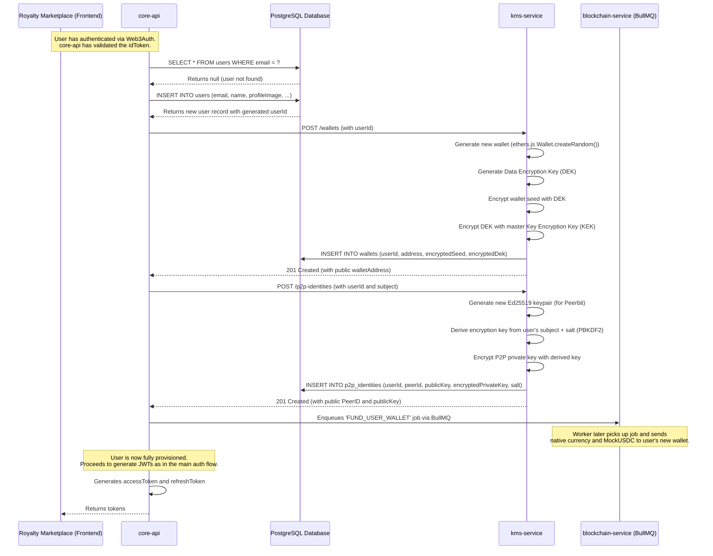

# Core Workflow: New User Provisioning

This document details the automated, one-time provisioning process that occurs the very first time a user logs into the Empressa platform. This flow is triggered within the main authentication workflow after the `core-api` determines that no user exists for the given email address.

The goal is to seamlessly create and secure all necessary cryptographic resources for the user—a blockchain wallet and a P2P identity—and provide them with initial funds for a smooth onboarding experience.

## High-Level Strategy

1.  **Detection:** The `core-api` detects a new user during the Web3Auth login process.
2.  **Database Record:** A new `User` record is created in the PostgreSQL database.
3.  **Secure Key Generation (`kms-service`):** The `core-api` makes two separate, secure calls to the `kms-service` to generate and encrypt the user's blockchain wallet and P2P identity. The `kms-service` is the only service that ever handles raw private keys.
4.  **Wallet Funding (`blockchain-service`):** After the wallet is successfully created, the `core-api` enqueues a `FUND_USER_WALLET` job. This is a "fire-and-forget" task to provide the new user with initial gas fees and MockUSDC.
5.  **Continuation:** Once the provisioning is complete, the `core-api` continues with the standard login flow, issuing JWTs to the user.

## Sequence Diagram

## Step-by-Step Explanation

1.  **New User Detection (`core-api`):**
    *   The `auth.service` in `core-api` receives a valid `idToken` from Web3Auth. It extracts the user's email and queries the `users` table in the database.
    *   The query returns no results, indicating this is the user's first login.

2.  **User Record Creation (`core-api`):**
    *   A new record is created in the `users` table with the user's email, name, and profile image (fetched and converted to a data URL). The user is marked as `isActive`.
    *   A corresponding record is also created in the `user_authentications` table to link their social login provider to their new user account.

3.  **Wallet Provisioning (`kms-service`):**
    *   The `core-api` makes a secure, internal `POST /wallets` request to the `kms-service`, sending the newly created `userId`.
    *   **Inside `kms-service`:**
        1.  A new Ethers.js wallet is created in-memory, generating a mnemonic phrase and a private/public key pair.
        2.  A cryptographically secure **Data Encryption Key (DEK)** is generated.
        3.  The wallet's mnemonic is encrypted using the DEK (AES-256-GCM).
        4.  The DEK itself is then encrypted using a master **Key Encryption Key (KEK)**, which is loaded from environment variables. This is **envelope encryption**.
        5.  The `kms-service` saves the user's public `walletAddress`, the encrypted mnemonic, and the encrypted DEK to the `wallets` table in the database. The raw private key and DEK are immediately discarded from memory.
    *   The `kms-service` responds to the `core-api` with the user's public `walletAddress`.

4.  **P2P Identity Provisioning (`kms-service`):**
    *   The `core-api` makes a second internal request, `POST /p2p-identities`, to the `kms-service`. It sends the `userId` and a stable, unique "subject" string derived from the user's Web3Auth login (e.g., `google-oauth2|12345...`).
    *   **Inside `kms-service`:**
        1.  A new Ed25519 keypair is generated for the P2P identity.
        2.  A secure salt is generated.
        3.  A strong encryption key is derived from the user's "subject" and the salt using PBKDF2. This ensures the key can be re-derived on the client-side for decryption.
        4.  The P2P private key is encrypted with this derived key.
        5.  The `kms-service` saves the public `peerId`, `publicKey`, the encrypted private key, and the salt to the `p2p_identities` table.
    *   The `kms-service` responds to the `core-api` with the public `peerId` and `publicKey`.

5.  **Wallet Funding (`blockchain-service`):**
    *   After receiving the successful response for wallet creation, the `core-api` immediately enqueues a `FUND_USER_WALLET` job into the `blockchain-jobs` BullMQ queue. This is a "fire-and-forget" operation and does not block the login flow.
    *   A worker in the `blockchain-service` will later pick up this job. It uses a pre-funded "faucet" wallet to send a small amount of native currency (for gas fees) and MockUSDC to the user's newly created wallet address.

6.  **Login Flow Continues:**
    *   With all resources provisioned, the `core-api` now has all the information it needs (user ID, public keys, etc.).
    *   It proceeds with the rest of the authentication flow: generating the JWT `accessToken` and `refreshToken` and returning them to the frontend. The user is now fully onboarded and logged in.