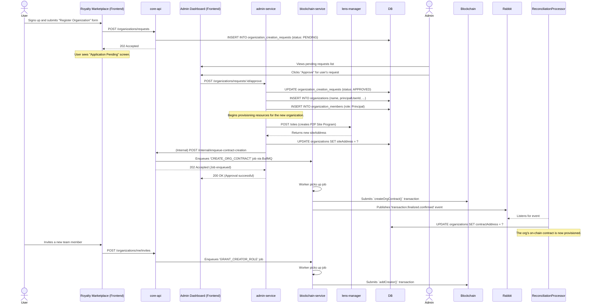

# Core Workflow: Organization Onboarding & Provisioning

This document describes the end-to-end workflow for a new user successfully applying for and being granted an organization on the Empressa platform. This is a multi-step process that involves an admin review, off-chain record creation, and the provisioning of essential on-chain and P2P resources.

There are two primary paths for organization creation:

1. **User Application:** A new user signs up and submits a request to create an organization.
2. **Admin Creation:** A platform administrator manually creates an organization and invites a user to become its Principal.

Both paths converge on the same automated provisioning logic once an organization record is created with a designated Principal user.

## Sequence Diagram

This diagram illustrates the "User Application" path, which is the more complex of the two.

## Step-by-Step Explanation

### Part A: User Application and Admin Approval

1. **User Submits Application (`royalty-marketplace`):**
    * A newly registered user who does not belong to an organization is directed to the "Register Your Organization" form.
    * Upon submission, the frontend sends a `POST /organizations/requests` request to the `core-api`.
    * The `core-api` creates a record in the `organization_creation_requests` table with a `PENDING` status.

2. **Admin Review (`admin-dashboard`):**
    * An administrator sees the new pending request in their dashboard.
    * After reviewing the details, the admin clicks "Approve". This sends a request to the `admin-service`.

3. **Approval and Initial Record Creation (`admin-service`):**
    * The `admin-service` updates the request's status to `APPROVED`.
    * Crucially, it creates the official `Organization` record in the database, linking it to the applicant as the `principalUserId`.
    * It also creates an `OrganizationMember` record, for
