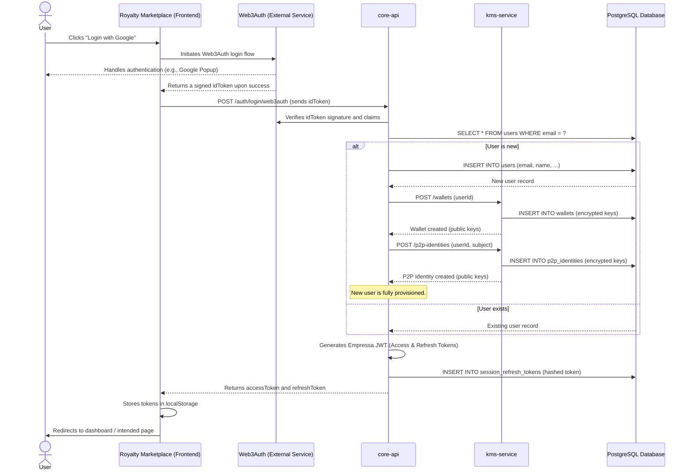

# Core Workflow: User Authentication

This document details the end-to-end authentication flow for a standard user logging into the **Royalty Marketplace**. This process involves the frontend, the external Web3Auth service, and several microservices within the `core-backend`.

The primary goal is to securely exchange a credential from a trusted identity provider (like Google or an email magic link) for a Empressa-specific JWT (JSON Web Token) that will be used for all subsequent API requests.

## Sequence Diagram

This diagram illustrates the step-by-step process of authentication, including the initial login and the provisioning of a new user.

## Step-by-Step Explanation

1. **User Initiates Login:** The user clicks a login button (e.g., "Login with Google") in the `royalty-marketplace` frontend.

2. **Web3Auth Flow:** The frontend SDK for **Web3Auth** takes over, handling the entire interaction with the chosen identity provider (e.g., Google, Apple, or a passwordless email link).

3. **Token Issuance:** Upon successful authentication with the provider, Web3Auth generates a signed JWT (`idToken`) and returns it to the frontend application. This token proves that the user has been authenticated.

4. **Backend Login Request:** The `royalty-marketplace` sends this `idToken` to the `core-api`'s `/auth/login/web3auth` endpoint.

5. **Token Validation:** The `core-api` receives the `idToken` and uses the `web3auth.service.ts` to validate its signature against Web3Auth's public keys (JWKS). This ensures the token is authentic and has not been tampered with.

6. **User Lookup/Creation:**
    * The `core-api` extracts the user's email from the validated token and queries the PostgreSQL database to see if a user with that email already exists.
    * **If the user is new:**
        1. A new record is created in the `users` table.
        2. The `core-api` makes two critical internal API calls to the `kms-service`:
            * **`POST /wallets`**: This triggers the creation of a new blockchain wallet for the user. The `kms-service` generates a private key, encrypts it, stores it in the database, and returns only the public address.
            * **`POST /p2p-identities`**: This triggers the creation of a new P2P identity. The `kms-service` generates a new keypair, encrypts the private key, stores it, and returns the public key and Peer ID.
        3. The `blockchain-service` is then notified (fire-and-forget) to fund the new user's wallet with some initial gas and USDC for a smooth onboarding experience.
    * **If the user exists:** The system proceeds to the next step.

7. **JWT Generation:** The `core-api` gathers all necessary information for the user (user ID, email, organization info, wallet public key, P2P public key) and creates a new, Empressa-specific JWT `accessToken`. It also generates a `refreshToken`.

8. **Session Storage:** The `accessToken` is designed to be short-lived. The `refreshToken` is stored (as a hash) in the database and is used to obtain new access tokens without requiring the user to log in again. This is a security pattern known as token rotation.

9. **Tokens Returned:** The `core-api` returns the `accessToken` and `refreshToken` to the `royalty-marketplace`.

10. **Session Established:** The frontend stores these tokens securely in `localStorage`. The `accessToken` is then automatically attached as a Bearer token to all subsequent requests to the `core-api`, authenticating the user for the duration of their session.
